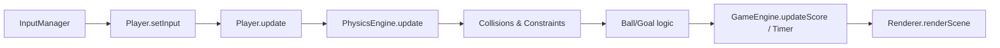

## PES 90 – Entities and Core Systems

A student-friendly overview of how each entity and core module works together in the game. This is intended as a learning guide to understand the architecture and extend it safely.

---

## Game Loop at a Glance

- **Flow**: Input → Player logic → Physics update → Collisions → Ball/Goal checks → UI/Timer → Render
- **Tick**: Physics runs at a fixed timestep (≈16.67ms). Rendering uses `requestAnimationFrame`.

---

## Entities

### `Entity` (base)
- **Represents**: Any in-game object with position and size.
- **Core properties**: `x`, `y`, `width`, `height`, `velocityX/Y`, `accelerationX/Y`, `maxSpeed`, `friction`, `active`, `tag`.
- **Lifecycle**:
  - `update(deltaTime)`: apply acceleration → friction → speed limit → move.
  - `render(ctx)`: default simple rectangle (overridden in subclasses).
- **Collision helpers**: `getBounds()`, `intersects(other)`, `distanceTo(other)`, `angleTo(other)`.
- **Utilities**: `setPosition(x,y)`, `setVelocity(x,y)`, `addVelocity(x,y)`, `normalizeVector(x,y)`.
- **Used by**: `Player`, `Ball`, `Goal`, `Field`.

### `Player`
- **Role**: A field player or goalkeeper. Can be AI-controlled or player-controlled.
- **Key properties**:
  - Team/role: `team` ('teamA'/'teamB'), `position` ('field'/'goalkeeper'), `isAI`.
  - Stats: `speed`, `accuracy`, `stamina`, `sprintMultiplier`.
  - Control: `inputX/Y`, `inputShoot`, `inputPass`, `isSprinting`.
  - Ball: `hasBall`, `ball`, `kickCooldown`, `kickRange`.
  - AI: `aiState`, `aiTarget`, `aiDecisionTimer/Interval`.
- **Behavior**:
  - `update(deltaTime)`: cooldowns → AI (if `isAI`) → `handleMovement` → `handleBallInteraction` → animations → stamina.
  - `handleMovement`: converts input/AI target to acceleration; applies sprint multiplier and updates facing `direction`.
  - `handleBallInteraction`: gain possession within `kickRange`; perform shoot/pass based on input or AI.
  - `kickBall(type)`: compute impulse with slight inaccuracy based on `accuracy`.
  - AI helpers: `updateAI`, `makeAIDecision`, `handleAIKick`, `findNearest`.
- **Render**: Colored rectangle with direction indicator, team band, and possession dot when `hasBall`.
- **Control API**: `setInput(x, y, shoot, pass, sprint)`, `setBall(ball)`.

### `Ball`
- **Role**: Circular physics object with friction, bouncing, trail, and possession state.
- **Key properties**: `radius`, `maxSpeed`, `friction`, `bounceFactor`, `possessor`, `lastPossessor`, trail buffers, simple sound placeholders.
- **Behavior**:
  - `update(deltaTime)`: manage possessor timer, update trail, keep in field, check goals.
  - Boundaries: `handleFieldBoundaries()` bounces off edges.
  - Goals: `checkGoal()` → `isInGoal(goal)` → `handleGoal(scoringTeam)` updates score, resets players/ball.
  - Possession: `setPossessor(player)` with cooldown timer.
- **Collision**: Overrides `getBounds()`/`intersects(other)` for circle vs AABB checks.
- **Render**: Circle with optional trail and possession indicator.

### `Team`
- **Role**: Holds players, score, side, and formation.
- **Key properties**: `name`, `color`, `side` ('left'/'right'), `players[]`, `score`, `formation`.
- **Behavior**:
  - Roster: `addPlayer`, `removePlayer`.
  - Queries: `getFieldPlayers()`, `getGoalkeeper()`, `getPlayerByPosition(position)`, `getNearestPlayerTo(x,y)`.
  - Positions: `resetPositions()` places players according to side; `getFormationPositions()`.
  - Tactics helpers: `getTeamCenter()`.
  - Frame: `update(deltaTime)`, `render(ctx)` delegates to players.

### `Goal`
- **Role**: Visual posts/net, team association, glow effect on goal.
- **Key properties**: `team`, post/net colors, `depth`, `glowIntensity`.
- **Behavior**: `update(deltaTime)` fades glow; `triggerGlow()`; `isBallInGoal(ball)`; `getGoalCenter()`; `getBounds()`.
- **Render**: Posts, crossbar, net grid, optional glow.

### `Field`
- **Role**: Draws pitch, lines, and decorative grass; provides field dimensions.
- **Key properties**: `fieldWidth/Height`, colors, line widths, circle radii, area sizes, `grassPattern`.
- **Behavior**: `render(ctx)` → `drawGrass` → `drawFieldMarkings` → `drawGrassPattern`.
- **Helpers**: `isInBounds(x,y)`, `getFieldCenter()`, `getPenaltyAreaBounds(team)`, `getGoalAreaBounds(team)`.

---

## Core Systems

### `GameEngine`
- **Role**: Sets up canvas, owns scenes, runs the game loop, tracks game state and UI.
- **Timing**: Fixed physics timestep (≈16.67ms) with variable render rate.
- **Game state**: `gameState` ('menu'|'playing'|'paused'|'gameOver'), `scores`, `matchTime` with start/end/pause logic.
- **Scenes**: `switchScene('menu'|'game')` with `enter/exit` calls.
- **UI**: `updateScore(team)`, `updateUI()` DOM updates; pause/game over overlays.

### `GameScene`
- **Role**: Wires entities and systems for a match.
- **Creates**: `Field`, two `Goal`s, two `Team`s with players (Team A: player-controlled; Team B: AI), `Ball`.
- **Systems**: `PhysicsEngine`, `AIManager`, `InputManager`, `Renderer`.
- **Update order**: InputManager → set player input → PhysicsEngine → AIManager → Teams/Goals → Renderer follow camera.
- **Utilities**: `getAllPlayers()`, `getTeamPlayers(team)`, `getGoal(team)`, `getPlayerControlled()`; reset helpers.

### `PhysicsEngine`
- **Role**: Updates all active entities, handles collisions and simple constraints.
- **Collisions**:
  - Player ↔ Ball: possession + small push.
  - Player ↔ Player: separation push to avoid overlap.
  - Ball ↔ Goal: triggers visual glow (goal scoring handled by `Ball`).
- **Constraints**: `keepInBounds(entity)`; air resistance for `ball`.
- **Queries**: `getPlayers()`, `getBall()`, `getGoals()`.

### `AIManager`
- **Role**: Central AI decision loop for AI players every ~200ms.
- **States**: `idle`, `chaseBall`, `support`, `defend`, `goalkeeper` (conceptual; actual `aiState` strings used on players).
- **Behaviors**:
  - Goalkeeper: stays within goal area, intercepts nearby balls.
  - Field player with possession: shoot if close; else pass or dribble.
  - Field player without possession: nearest chases; others support/defend.
- **Team coordination**: `coordinateTeam(team)` assigns roles (chaser/support/defend). Helpers for support/defense positions.

### `InputManager`
- **Role**: Normalizes keyboard, mouse/touch, and on-screen joystick into a simple input state.
- **Controls**:
  - Desktop: Arrow/WASD (move), Space (shoot/pass), P (pass), Shift (sprint), Enter (pause/resume).
  - Mobile: joystick + on-screen buttons (`shoot`, `sprint`).
- **Menu bindings**: Start/Resume/Restart/Quit/Play Again buttons.
- **API**: `update()`, `getInputState()`, `clearInput()`.

### `Renderer`
- **Role**: Renders scenes with camera, particles/effects, and UI overlays.
- **Order**: Field → Goals → Entities (ball → players) → Particles/Effects → UI (score, timer, possession, stamina).
- **Camera**: `followEntity(entity)` centers on ball; `setCamera(x,y,zoom)`.
- **Effects**: `createGoalEffect`, `createKickEffect` (particle helpers).

---

## Data & Interaction Summary

- **Input → Player**: `InputManager` maps device input to `Player.setInput` each frame.
- **Player ↔ Ball**: Within `kickRange`, player gains possession; can shoot or pass (with slight inaccuracy).
- **Physics**: Applies friction/air resistance; resolves simple collisions and keeps entities in bounds.
- **Scoring**: `Ball` detects goal entry → calls `GameEngine.updateScore(team)` → resets ball and players.
- **Rendering**: `Renderer.renderScene(scene)` draws world and UI; follows the ball.

---

## Extending the Game (Guidance)

- **Add a new entity**: subclass `Entity`, set a unique `tag`, override `update`/`render`, add to `GameScene.entities` and `PhysicsEngine` if needed.
- **Tune physics**: adjust `friction`, `maxSpeed`, `bounceFactor`, `airResistance` in entities/physics.
- **Enhance AI**: expand `AIManager` states and decision logic; add team tactics in `coordinateTeam`.
- **New controls**: map keys/touch in `InputManager` and pipe into `Player.setInput`.
- **Visual polish**: extend `Renderer` effects and camera behavior; tweak `Field` visuals.
- **Audio**: replace placeholder console logs in `Ball.playKickSound()`/`playGoalSound()` with real sounds.

---

## Glossary

- **Entity tag**: `entity`, `player`, `ball`, `goal`, `field` – used by renderer and physics to determine behavior/order.
- **Delta time**: Time step passed to `update` methods (ms), used to make movement frame-rate independent. 